# Android01 labor - HelloWorld

## Feladat 1

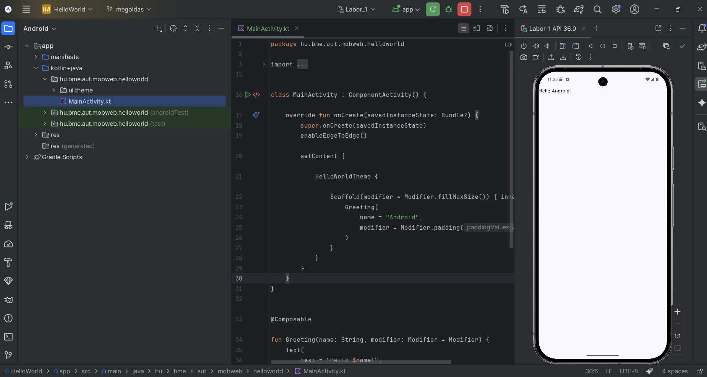

Magyarázat: Rá kellett nyomni a 'Run' gombra, a build után az alkalmazás feltelepült az emulátorra és el is indult.

## Feladat 2

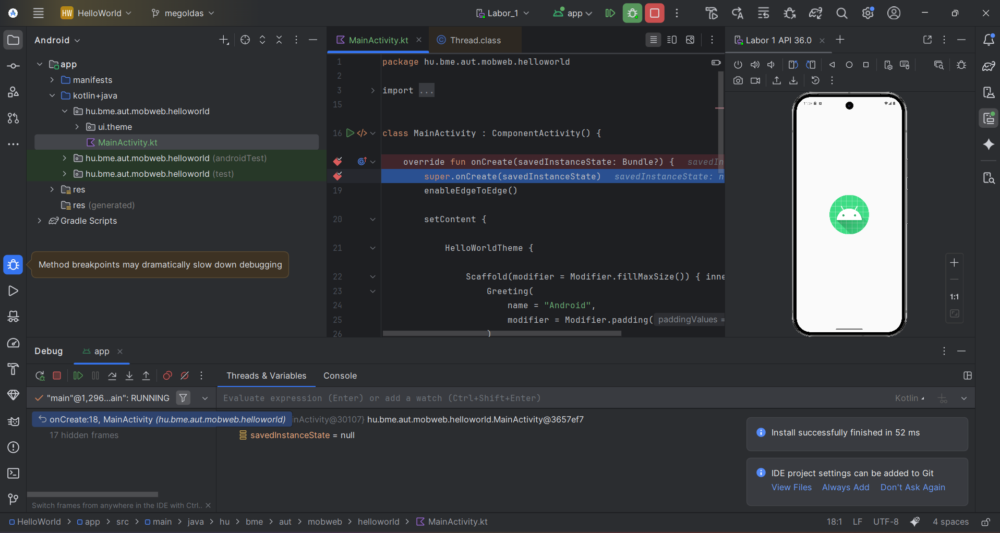

Magyarázat: Rá kellett nyomni a 'Debug' gombra, a build után az alkalmazás feltelepült az emulátorra és elindulna ha nem pont oda raktam volna a breakpointot. Ha tovább engedem ugyan úgy betölt mindent.

## Feladat 3

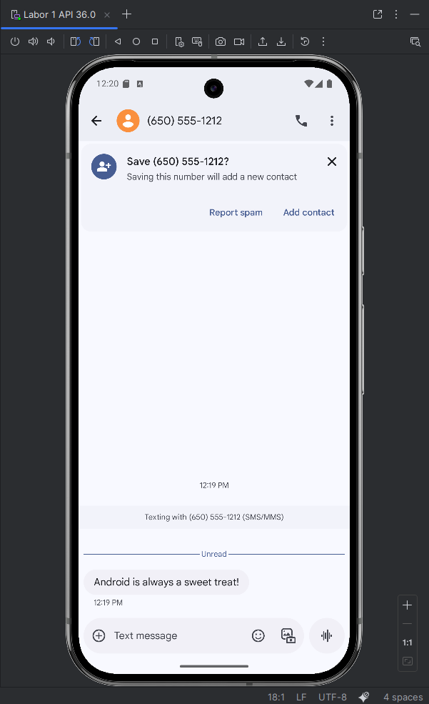
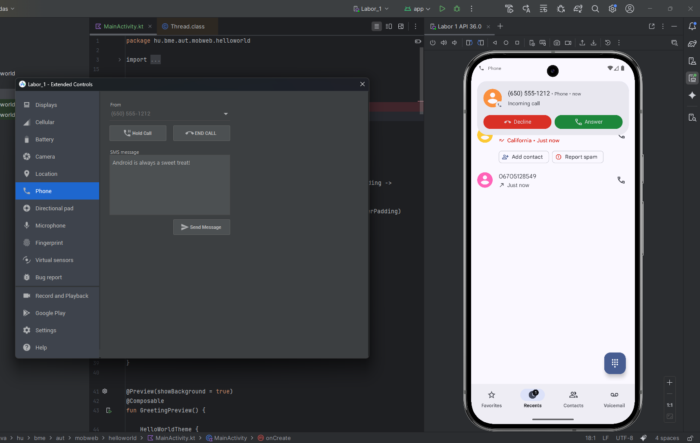

Magyarázat: A panel a futó emulátor jobb oldalán található vezérlő gombok közül a ... gombnál értem el a 'extended controls' menüt ahol a 'Phone' almenüben tudtam felhívni az emulátort és SMS-t küldeni.

## Feladat 4

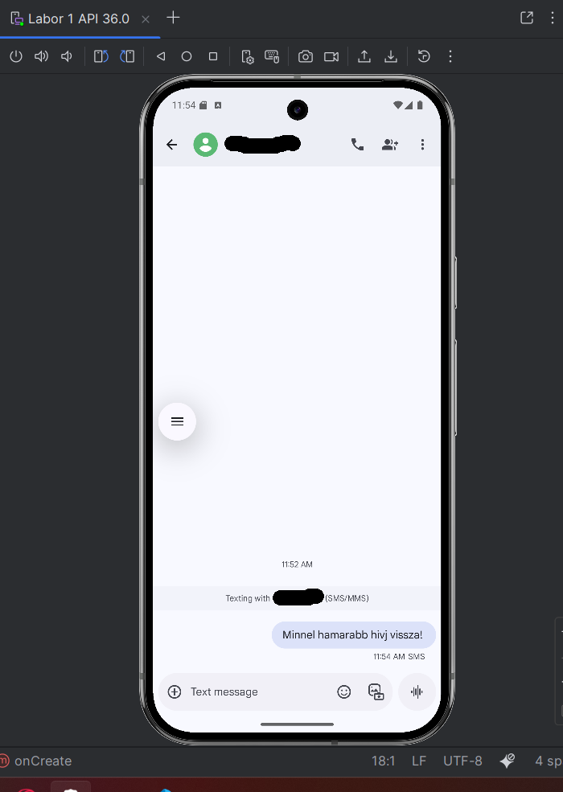
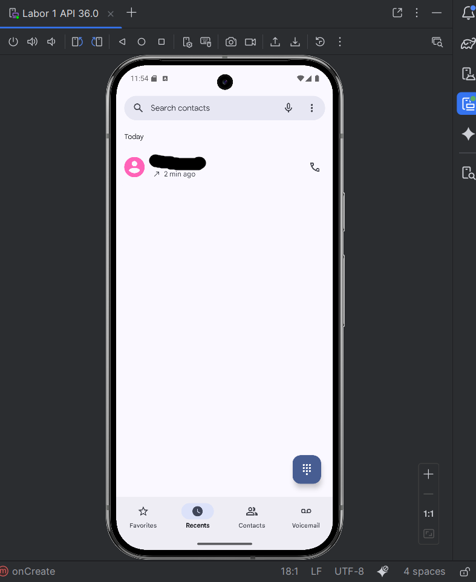

Magyarázat: Megprobáltam felhívni egy valódi telefonszámot, de mivel nincsen benne sim kártya ezért nem csöngött ki és az SMS-t sem kaptam meg. 

## Feladat 5

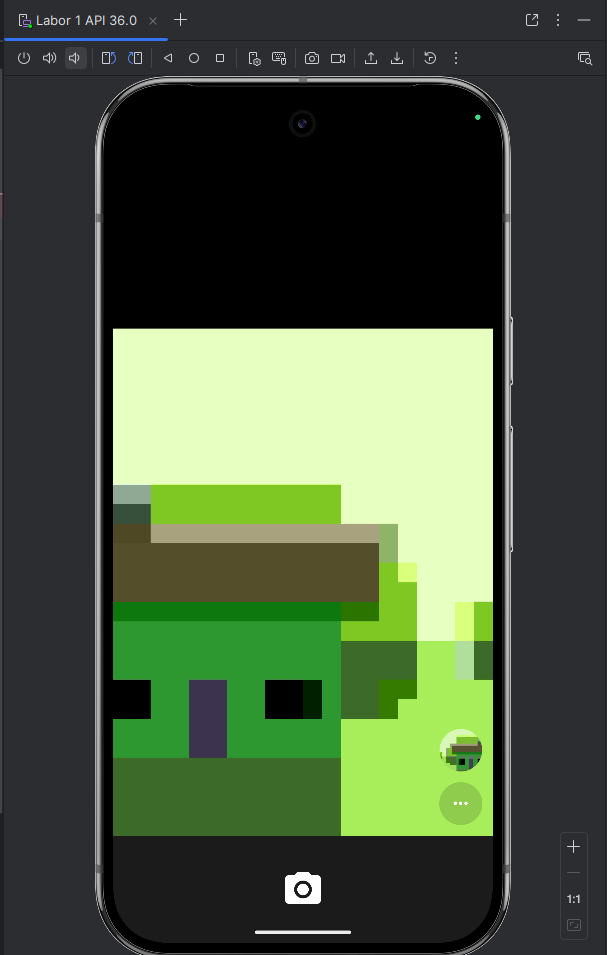
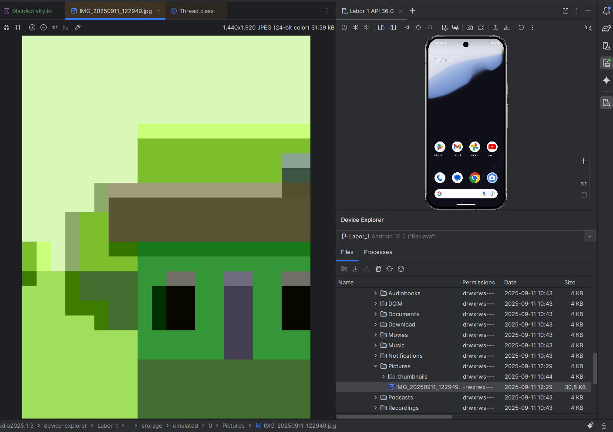

Magyarázat: Az emulátor sgítségével készítettem egy képet és aztán View menüpont Tool Windows almenüjének Device Explorer funkcióját választottam. Itt tudtam a emulátor fájlrendszerében kutakodni és sikerült megtalálnon az imént lefotozott képet.

## Feladat 6

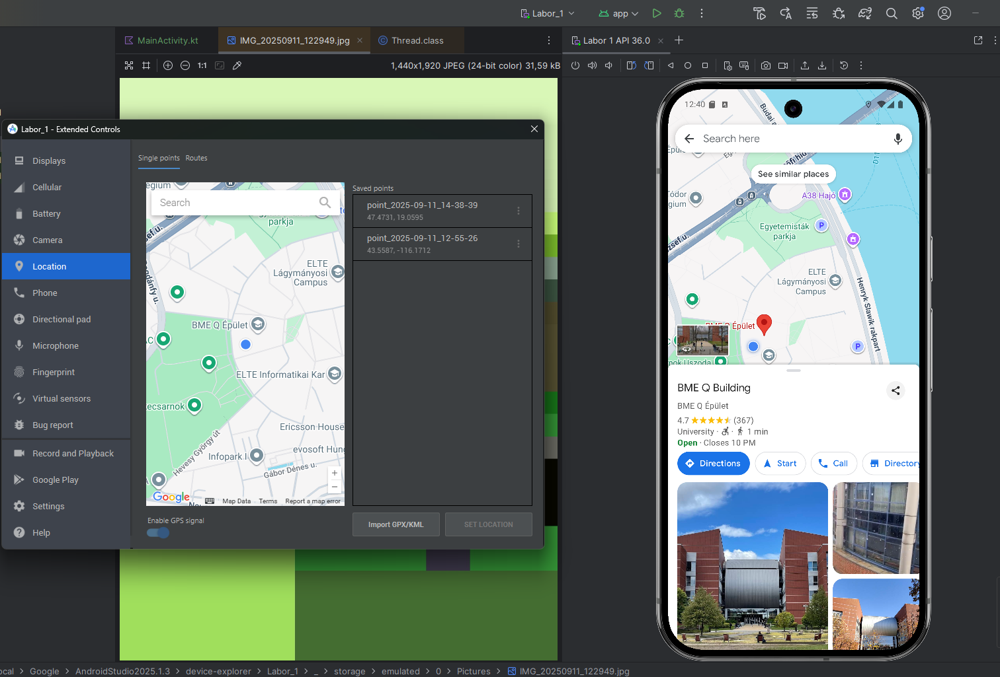

Magyarázat: A panel a futó emulátor jobb oldalán található vezérlő gombok közül a ... gombnál értem el a 'extended controls' menüt ahol a Location almenüben tudtam a emulátor helyzetét beállítani. A maps applikáció segítségével meg is győződtem arról hogy jó helyen vagyok.

## Feladat 7

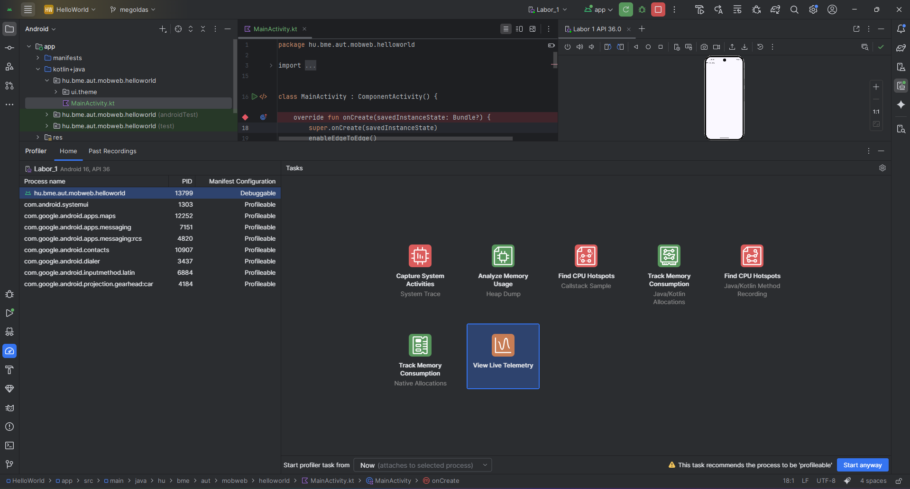
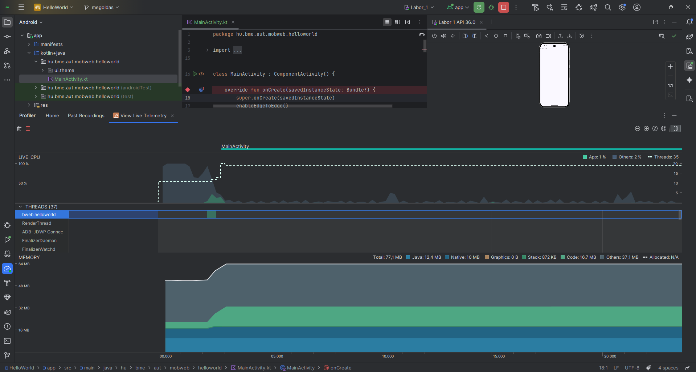

Magyarázat: A View menüpont Tool Windows amenüjének Profiler almenüjében található. Itt elindítottam a HelloWorld projektet és futtattam az emulátoron egy 'View Live Telemetry' az adott pillattól fogva. Azon belül megnéztem a nyitott szálak számát és memóriafoglalását. 35 nyitott szál van és 77,1 mb fogyaszt a memóriából.

## Feladat 8

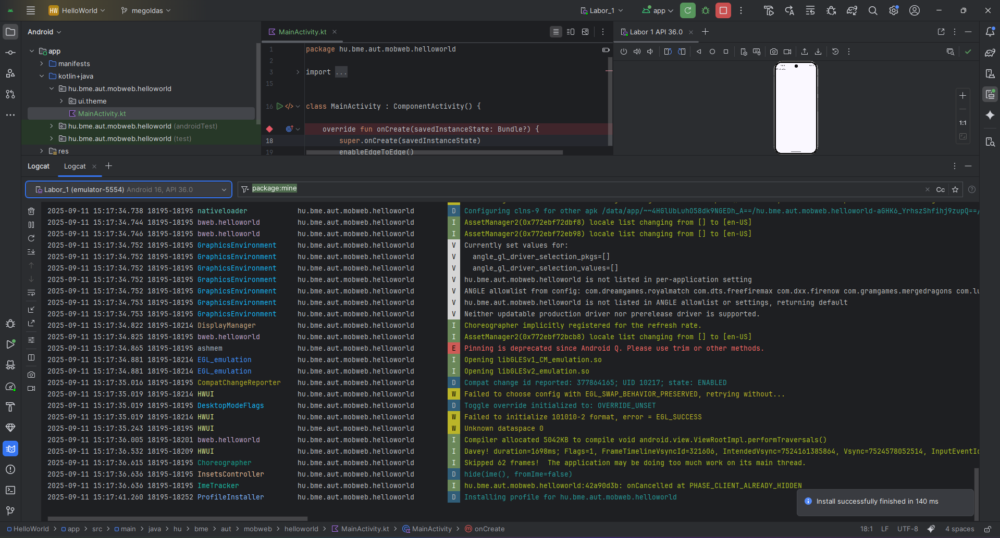

Magyarázat: A logcat eszközben látom hogyha bármi változik az emulátoron. Ha elindítom a pojektet vagy ha kilépek belőle. Ez szolgál állapot információkkal.

## Feladat 9

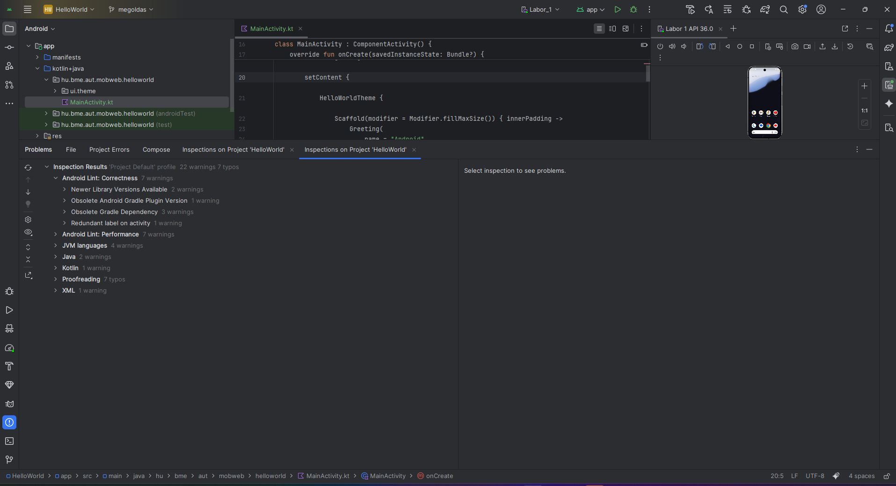

Magyarázat: Hiba nincsen inkább warnings és typos van. A legtöbb az lintek amik fontosak a mobil programozás szempontjából mert ezek szabályok nem a default Android Studio szinten használják, hanem kibővítve. Ezek inkább megjelenítésre és teljesítmény beli optimalizálásra hívja fel a figyelmet.

## Feladat 10

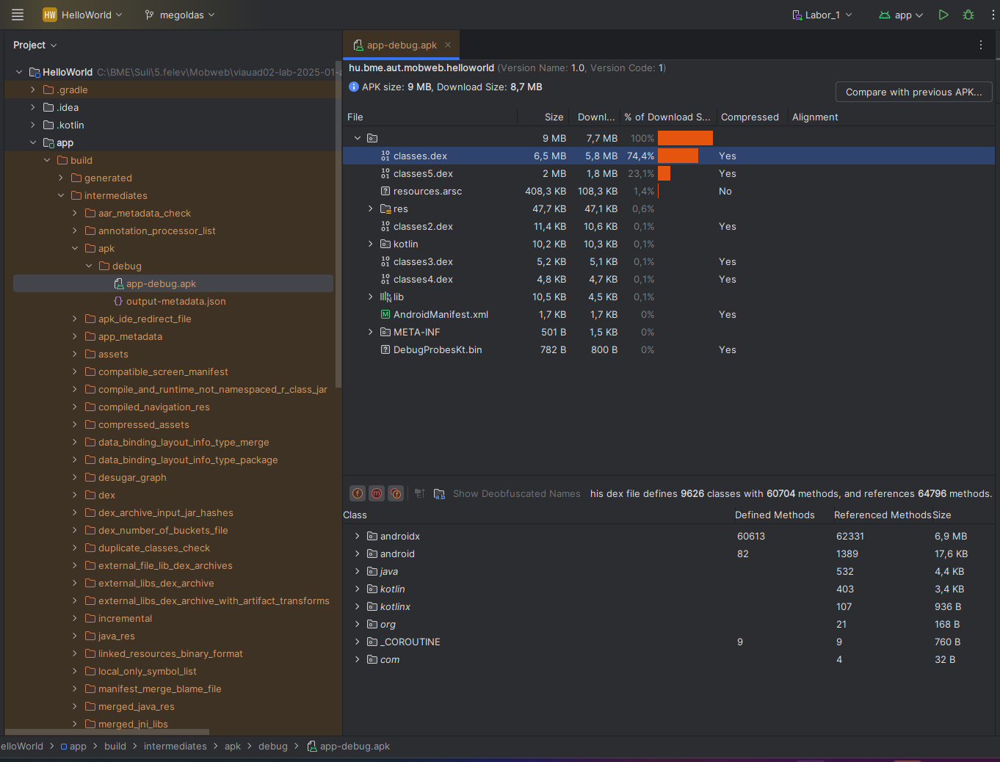

Magyarázat: A HelloWorld projekted APK-ján belül a lefordított kód a classes.dex állományokban található.
